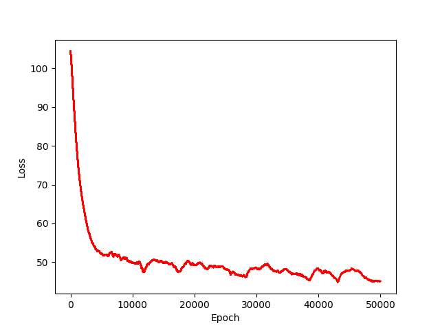

# LSTM for character prediction
The task is to predict next character in the sequence using sequential model like LSTM . Here i have used shakespeare dataset to see how well does LSTM composes its own writing using some context learn over time on shakespeare writing.

## How to run the code:
```
#To test without peephole connections.
python code/lstm_without_peephole.py
#To test it with peephole connections.	
python code/lstm_with_peephole_connections.py
```
## Comparison of convergence:

## TO-DO List:
- [x] LSTM without peephole connections.
- [x] LSTM with peephole connections.
- [ ] Bidiectional  LSTM.
- [ ] Performance Matrix.


 

