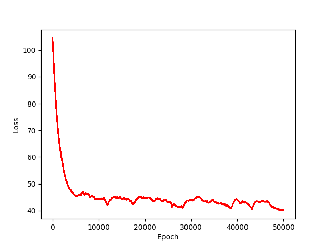

# LSTM for character prediction
The task is to predict next character in the sequence using sequential model like LSTM . Here i have used shakespeare dataset to see how well does LSTM composes its own writing using some context learn over time on shakespeare writing.

## How to run the code:
```
#To test without peephole connections.
python3 code/lstm_without_peephole.py
#To test it with peephole connections.	
python3 code/lstm_with_peephole_connections.py
#To test Bi-directional LSTM.	
python3 code/LSTM/blstm_train.py
```
## Loss graph of LSTM without Peephole connection:

## Loss graph of LSTM with Peephole connection:

## Loss graph of Bi-directional LSTM with Peephole connection:

## Things Completed:
- [x] LSTM without peephole connections.
- [x] LSTM with peephole connections.
- [x] Bidiectional  LSTM.
- [ ] Nested LSTM.
- [ ] GRU Unit.
- [ ] Support for custom loss Function.


 

